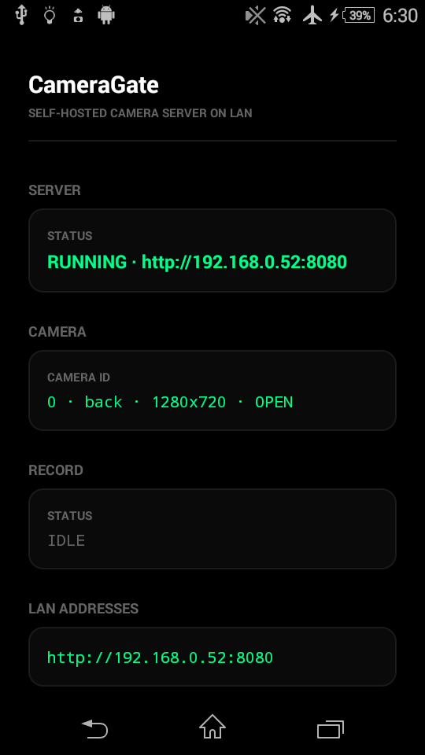
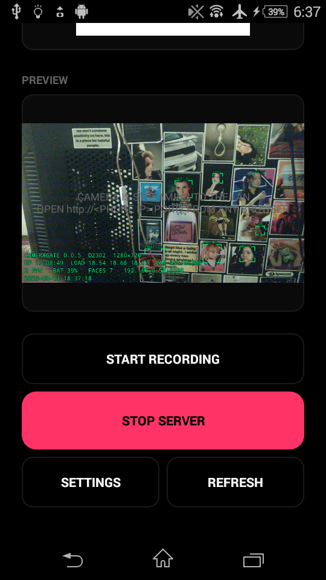
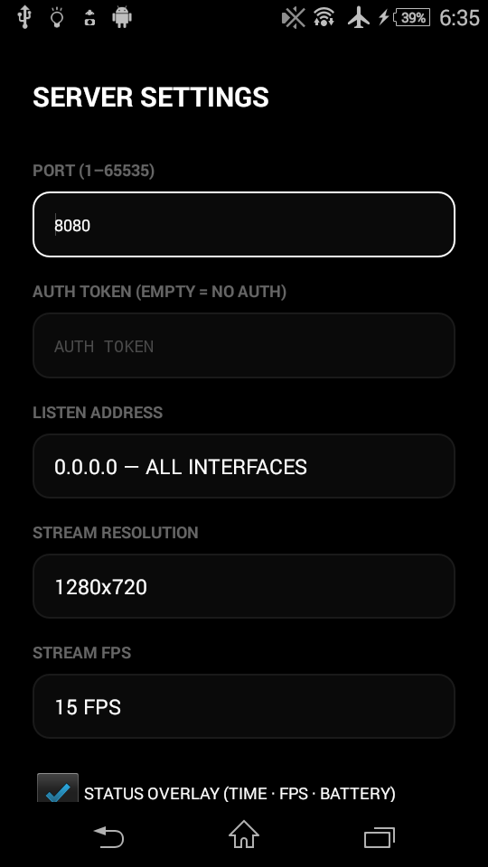
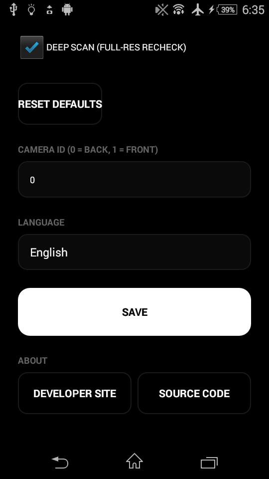

# CameraGate

Self-hosted camera server Android app. Turns an old Android phone into a camera server: capture snapshots, watch a live stream, or record video from the phone's camera over your LAN — via HTTP + WebSocket.

**Works on Android 4.x (API 16) up to the latest Android.** Pure Java, classic Camera API, no modern Android features required.

## Screenshots

| Main Screen (Running) | Main Screen (Bottom) |
| --- | --- |
|  |  |


| Settings | Advanced Settings |
| --- | --- |
|  |  |

## Features

- `GET /snapshot` — latest frame as JPEG
- `GET /stream` — MJPEG live stream (plays in any browser, VLC, ffplay)
- `GET /ws` — WebSocket stream, binary JPEG frames
- `POST /record/start` / `POST /record/stop` — MP4 recording to `/sdcard/CameraGate`
- `GET /qr` — QR code of the server URL
- `GET /health` — liveness probe, `GET /swagger` — OpenAPI 3.0 spec
- Optional token auth (header or query parameter)
- On-device face detection — pure-Java Viola-Jones / Haar cascade engine (no OS/NDK dependencies), hacker-style green targeting boxes
- Foreground service + wake lock keeps the camera alive with the screen off
- Bilingual UI (English / فارسی) with runtime language selector, RTL for Persian
- Runs on Android 4.x — no androidx, no `java.time`, Java 7-style source

## Getting started

Requirements: JDK 17+, Android SDK, Gradle.

```bash
scripts/build.sh               # debug APK
scripts/build.sh release       # signed release APK (app/key.properties)
scripts/hosttest.sh            # host-side cascade engine tests (no phone)
scripts/run.sh                 # install + launch on the phone
```

APK output: `app/build/outputs/apk/`. Install via ADB or copy the APK to the phone.

1. Open **CameraGate** on the phone, tap **Start server**.
2. The screen shows the LAN URL `http://<phone-ip>:8080/` and its QR code.
3. On another machine on the same WiFi, open that URL.

```bash
# state
curl http://192.168.1.10:8080/camera

# one frame
curl -o frame.jpg http://192.168.1.10:8080/snapshot

# record 10 seconds
curl -X POST http://192.168.1.10:8080/record/start
sleep 10
curl -X POST http://192.168.1.10:8080/record/stop
```

With a token configured, add `?token=YOUR_TOKEN` or `Authorization: Bearer YOUR_TOKEN` to every request.

## WebSocket client (Go)

[`ws-client/`](./ws-client) — a desktop Go client (Fyne UI) that connects to `ws://<ip>:8080/ws`, decodes the binary JPEG frames and shows the live stream in a window. It can also save raw frames to disk.

```bash
cd ws-client
go run . 192.168.1.10 8080            # interactive, or:
go run . -url ws://192.168.1.10:8080/ws -out frames/   # frames -> disk
```

Use `-direct` for a raw Go TCP dialer instead of the curl transport.

## Architecture

```
app/src/main/java/com/danials/cameragate/
    MainActivity.java         server UI, preview, QR, record buttons
    SettingsActivity.java     port / token / camera settings
    CameraGateService.java    foreground service + wake lock + watchdog
    core/
      CameraGate.java         facade: camera + HTTP + settings
      CameraSource.java       legacy Camera API + MediaRecorder recording
      JpegFrames.java         NV21 -> JPEG pipeline + face scan thread
      HttpServer.java         HTTP/1.1 + MJPEG + WebSocket
      face/                   Haar cascade engine (Viola-Jones)
ws-client/                    Go desktop stream viewer (Fyne)
scripts/                      build / run / test helpers
screenshots/                  on-device test evidence
```

## Testing

```bash
scripts/check.sh --release     # compile + lint + release
scripts/hosttest.sh            # host-side cascade engine tests (2200+ assertions, no phone)
scripts/device_test.sh         # full on-device smoke + resilience test
```

`scripts/device_test.sh` drives the real phone over ADB: installs, starts the server, hits every endpoint, checks the server survives screen-off and swipe-away, and collects screenshots + logcat.

## License

GPL-3.0-or-later — see [LICENSE](./LICENSE).

## AI Assistance

Parts of this project were developed with assistance from DeepSeek.